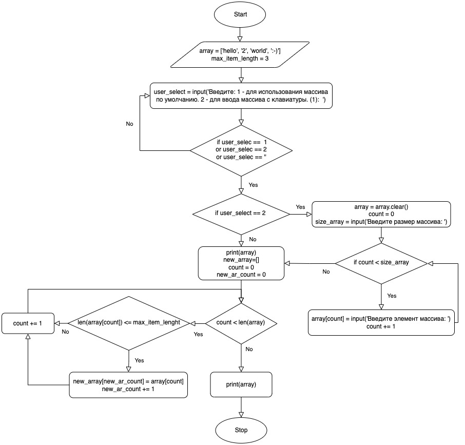

# First_block-test_work

## Проверочная работа по итогу прохождения первого блока обучения.

**Задача:** Написать программу, которая из имеющегося массива строк формирует массив из строк,
длина которых меньше, либо равна 3 символа. Первоначальный массив можно ввести с клавиатуры,
либо задать на старте выполнения алгоритма. При решении не рекомендуется пользоваться коллекциями,
лучше обойтись исключительно массивами.

**Решение:**

Блок-схема алгоритма решения 

1. Реализовано 2 варианта ввода массива, использование массива по умолчанию заданного на старте программы и ввод
   массива с клавиатуры пользователем.
2. Реализована в цикле проверка элементов массива и те элементы, что соответствуют условию длины строк
   меньше или равно 3, добавляются в новый массив.
3. Выводится на экран первоначальный массив и новый массив, сформированный из сторок первоначального массива,
   удовлетворяющих условию задачи.

Программа написана на языках Python, файл [main.py](main.py) и C#, файл [Program.cs](C-Sharp/Program.cs).

